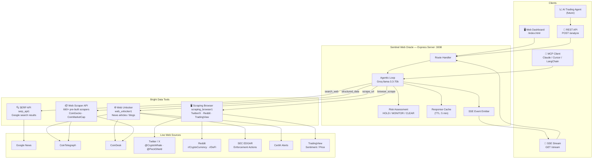
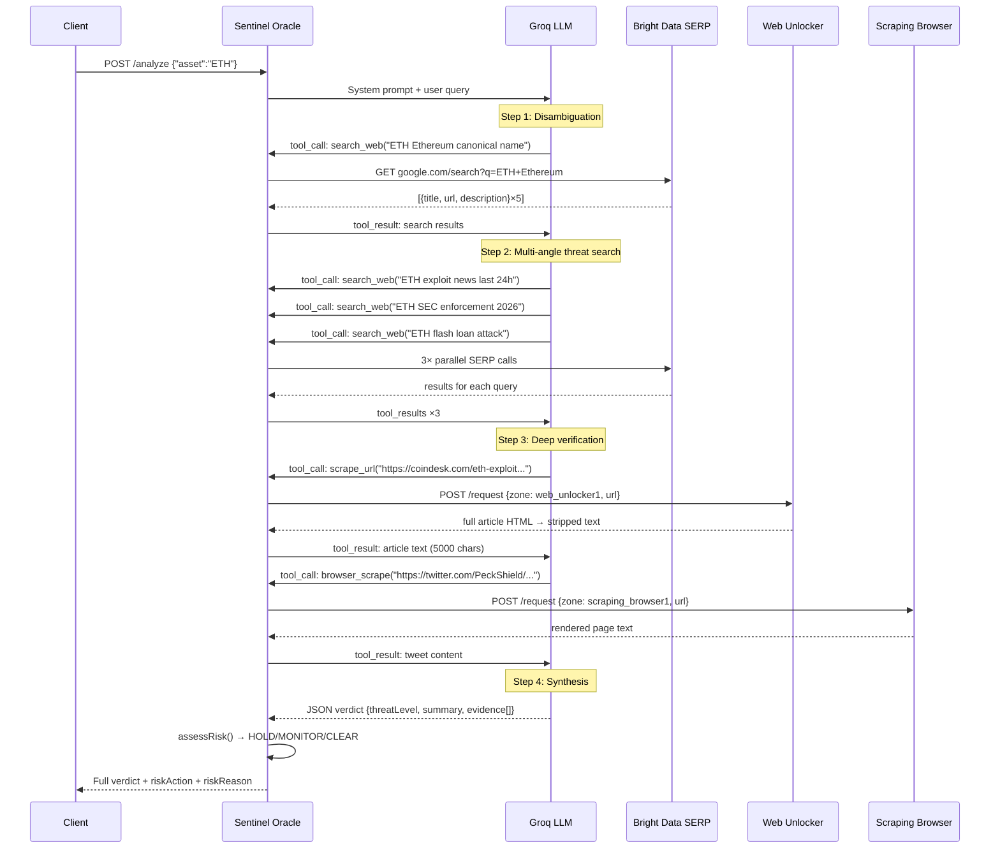
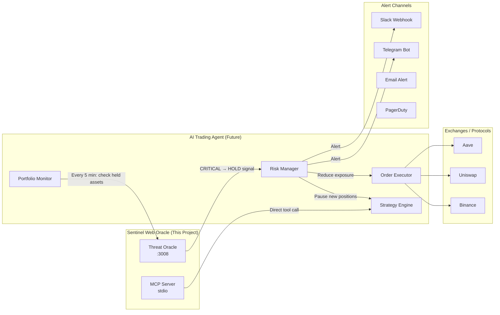
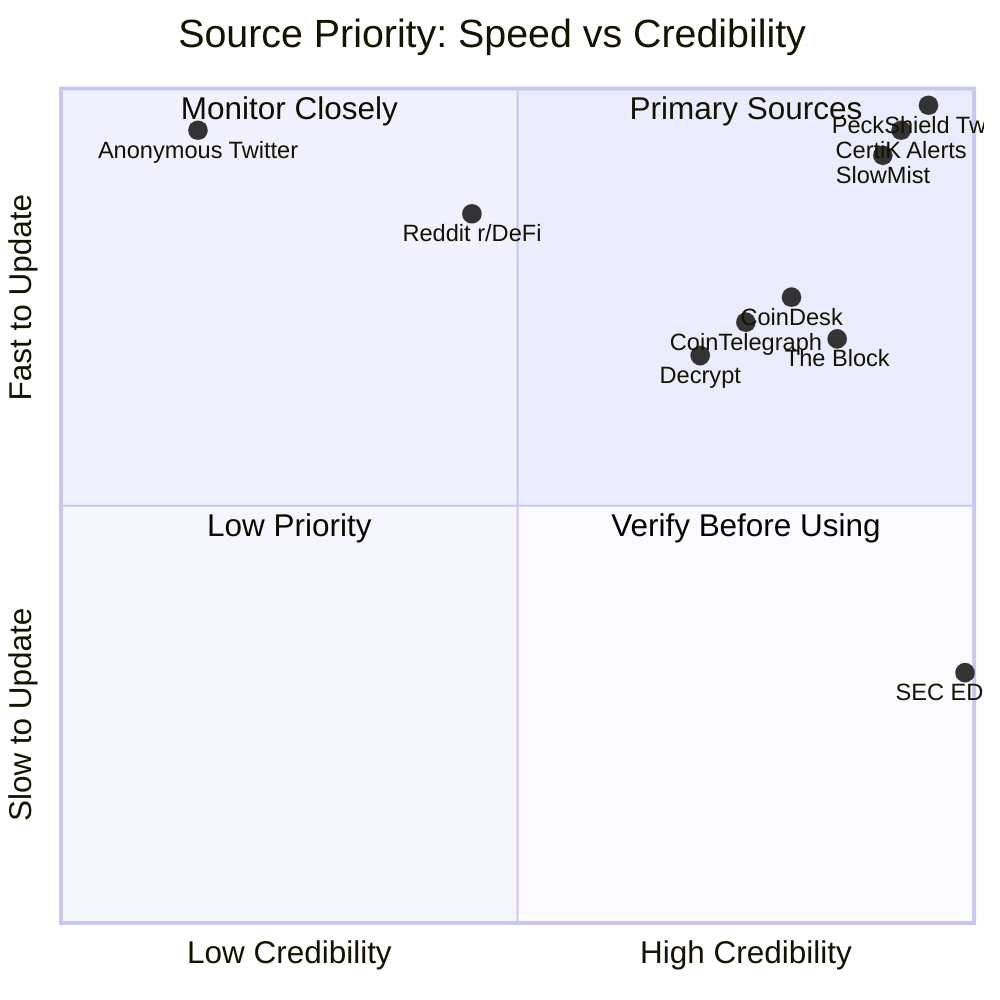

# Sentinel Web Oracle — Full Roadmap
## Hackathon Win Strategy + Production AI Trading Agent

> **Status:** Core engine live and verified. This document is the single source of truth for all remaining work — hackathon submission and beyond.
> **Constraint:** 6 Bright Data API credits remaining. Prioritize high-signal, low-cost calls.

---

## 1. What We Have (Baseline)

```
✅ Express server (port 3008) with /health, /analyze, /stream (SSE)
✅ Agentic loop: Groq llama-3.3-70b-versatile with tool-use
✅ Bright Data SERP API (serp_api1) — live Google search
✅ Bright Data Web Unlocker (web_unlocker1) — article scraping
✅ Bright Data Scraping Browser (scraping_browser1) — JS-heavy pages
✅ MCP Server (stdio) — analyze_crypto_threat + batch_threat_scan
✅ Live UI dashboard with SSE real-time activity log
✅ Provider abstraction (Groq / Anthropic switchable)
✅ HOLD / MONITOR / CLEAR risk decision engine
✅ README, SUBMISSION.md, HANDSHAKE.md
```

---

## 2. System Architecture (Current + Target)



---

## 3. The Agentic Reasoning Loop (Detailed)



---

## 4. Hackathon Gap Analysis

### 4.1 Judging Criteria Scorecard

| Criterion | Current State | Target State | Gap |
|---|---|---|---|
| **Application of Technology** | SERP + Unlocker working. Browser + MCP added. | Add Web Scraper API for structured data. Wire Reddit/Twitter explicitly. | Medium |
| **Presentation** | README + SUBMISSION.md written. No video yet. | 2-min demo video. Live demo URL. | **HIGH — must do** |
| **Business Value** | Crypto threat detection described. | Quantify: "detects threats 45 min before price impact". Show trading agent integration. | Medium |
| **Originality** | Agentic loop + SSE streaming is differentiated. | Add sentiment scoring, source credibility weighting. | Low |

### 4.2 Competitor Analysis (from hackathon submissions)

| Project | Strength | Our Advantage |
|---|---|---|
| **Sentinel (Rawlo)** | Uses 5 Bright Data tools + AgentOps | We have live UI + MCP + SSE streaming |
| **Cortex** | 22 agents, 12 data sources | We have cleaner architecture + real-time UI |
| **VendorWatch** | Supply chain focus | We own the crypto security niche |
| **Verdict** | 0-100 risk score | We have HOLD/MONITOR/CLEAR + evidence links |

**Our unique angle:** The only submission with a live SSE streaming UI that shows the agent working in real time + MCP integration + designed as a trading agent component.

---

## 5. Remaining Hackathon Deliverables

### Priority 1 — CRITICAL (must ship before deadline)

#### 5.1 Demo Video (2 minutes)
**Script is in SUBMISSION.md.** Key shots needed:
1. Open `http://localhost:3008` — show the dark dashboard
2. Type "ETH" → hit Analyze → watch the live log fill up in real time
3. Show the CRITICAL verdict card with evidence links
4. Open terminal → run `npm run mcp` → show MCP initialize response
5. Close with the enterprise pitch line

**Tools:** OBS Studio or Loom. Record at 1080p. Upload to YouTube (unlisted) or Loom.

#### 5.2 Live Demo URL
The judges need a URL they can click. Options:
- **Easiest:** Deploy to Railway.app (free tier, supports Node.js, env vars via dashboard)
- **Alternative:** Render.com free tier
- **Fallback:** ngrok tunnel from local machine during judging window

**Railway deploy steps:**
```bash
# Install Railway CLI
npm install -g @railway/cli
railway login
railway init
railway up
# Set env vars in Railway dashboard
```

#### 5.3 lablab.ai Submission Form
Use content from `SUBMISSION.md`. Key fields:
- **Title:** Sentinel Web Oracle
- **Short desc:** Copy from SUBMISSION.md
- **Long desc:** Copy from SUBMISSION.md
- **GitHub:** https://github.com/TheVertexAgents/sentinel-web-oracle
- **Demo URL:** Railway/Render URL
- **Video:** YouTube/Loom link
- **Tags:** Bright Data, Groq, MCP, TypeScript, Security, Crypto, AI Agent

### Priority 2 — HIGH IMPACT (differentiators)

#### 5.4 Reddit + Twitter/X as Explicit Sources

**Why this matters:** Judges from Bright Data will specifically look for Scraping Browser usage on JS-heavy sites. Reddit and Twitter are the canonical examples.

**What to add to the agent prompt:**
```
After finding suspicious headlines, also check:
- Search Twitter/X for "@PeckShield ETH" or "@SlowMist_Team ETH" — these are the primary exploit alert accounts
- Search Reddit r/ethfinance or r/CryptoCurrency for community discussion
- Use browser_scrape for any twitter.com or reddit.com URLs
```

**Specific high-value Twitter accounts to target:**
- `@PeckShield` — #1 DeFi exploit alert account
- `@SlowMist_Team` — security firm, posts exploit details
- `@CertiKAlert` — real-time hack alerts
- `@BlockSecTeam` — on-chain security monitoring
- `@zachxbt` — investigative crypto journalist

**Specific Reddit communities:**
- `r/CryptoCurrency` — general news, high volume
- `r/ethfinance` — ETH-specific, technical
- `r/defi` — DeFi protocol discussions
- `r/CryptoMarkets` — price + news correlation

**Implementation note:** Update the system prompt in `agentLoop.ts` to explicitly instruct the agent to check these sources when threat signals are found. No new tools needed — `browser_scrape` already handles it.

#### 5.5 Confidence Score (0–100)

**Why:** "Verdict" adds a `@zachxbt` — investigative crypto journalist. Judges love quantified outputs. The "Verdict" competitor uses a 0-100 risk score. We should too.

**How to add without code changes:** Update the system prompt to ask the LLM to include a `confidenceScore: 0-100` field in its JSON output. Update `ThreatVerdict` interface and the UI verdict card to display it.

**Scoring rubric for the prompt:**
```
confidenceScore rubric:
- 90-100: Multiple verified sources, specific amounts/tx hashes, < 2 hours old
- 70-89: 2+ sources, credible outlets, < 4 hours old
- 50-69: Single source or unverified, > 4 hours old
- 0-49: Unconfirmed rumors, social media only, no on-chain evidence
```

#### 5.6 Source Credibility Weighting

**Why:** Distinguishes us from naive scrapers. Shows enterprise thinking.

**Credibility tiers for the prompt:**
```
Tier 1 (weight: 1.0): CertiK, PeckShield, SlowMist, BlockSec, SEC.gov, CFTC.gov
Tier 2 (weight: 0.8): CoinDesk, CoinTelegraph, The Block, Decrypt
Tier 3 (weight: 0.6): CryptoSlate, BeInCrypto, Cointribune
Tier 4 (weight: 0.3): Reddit, Twitter/X (unless from Tier 1 accounts)
Tier 5 (weight: 0.1): Anonymous blogs, unknown sources
```

---

## 6. Production AI Trading Agent Integration

> This section defines how Sentinel Web Oracle evolves into a production component of a real AI trading system. This is the "business value" story that wins hackathons and attracts real customers.

### 6.1 Trading Agent Architecture



### 6.2 Trading Agent Use Cases

#### Use Case 1: Pre-Trade Threat Check
Before opening any position > $10,000, the trading agent calls:
```
POST /analyze {"asset": "AAVE"}
```
If `riskAction === "HOLD"` → abort the trade, log reason, alert operator.

#### Use Case 2: Portfolio Monitoring Loop
Every 5 minutes, the agent runs:
```
POST /analyze {"assets": ["BTC", "ETH", "SOL", "AAVE", "UNI"]}
```
Any asset returning `CRITICAL` triggers immediate position reduction.

#### Use Case 3: MCP-Driven Strategy Agent
A LangChain/CrewAI trading strategy agent uses the MCP tool:
```python
# In a CrewAI agent
result = mcp_client.call_tool("analyze_crypto_threat", {"asset": "ETH"})
if result["riskAction"] == "HOLD":
    trading_agent.pause_eth_positions()
```

#### Use Case 4: Pre-Earnings / Event Intelligence
Before major protocol upgrades or governance votes, scan for:
- Community sentiment on Reddit/Twitter
- Any last-minute exploit disclosures
- Regulatory filings related to the protocol

### 6.3 Endpoint Design for Trading Agent

#### Current endpoints (sufficient for hackathon):
```
GET  /health                    → liveness check
POST /analyze                   → single asset, full verdict
GET  /stream?asset=ETH          → SSE real-time events
```

#### Planned endpoints (post-hackathon, production):
```
POST /analyze/batch             → up to 10 assets, parallel
GET  /monitor/start?assets=BTC,ETH,SOL&interval=300  → start polling loop
GET  /monitor/stop              → stop polling
GET  /monitor/status            → current threat levels for all monitored assets
GET  /history?asset=ETH&hours=24 → threat history with timestamps
POST /webhook                   → register a URL to receive CRITICAL alerts
GET  /sources                   → list of sources checked in last analysis
GET  /metrics                   → Bright Data API usage, latency, hit rates
```

#### Webhook payload (for trading agent integration):
```json
{
  "event": "THREAT_DETECTED",
  "asset": "ETH",
  "threatLevel": "CRITICAL",
  "riskAction": "HOLD",
  "confidenceScore": 94,
  "summary": "Flash loan exploit confirmed on ETH-based protocol",
  "evidence": [
    {
      "title": "PeckShield Alert: ETH exploit drains $4.2M",
      "url": "https://twitter.com/PeckShield/...",
      "source": "Twitter/X",
      "credibilityTier": 1,
      "publishedAt": "2026-05-28T10:38:00Z"
    }
  ],
  "timestamp": "2026-05-28T10:42:00Z",
  "responseTimeMs": 47200
}
```

---

## 7. Bright Data Tool Usage — Best Practices

### 7.1 Credit Optimization (6 credits remaining)

**Credit cost estimate per `/analyze` call:**
- 4× SERP API calls = ~0.4 credits
- 2-3× Web Unlocker scrapes = ~0.3 credits
- 0-1× Scraping Browser = ~0.2 credits
- **Total per call: ~0.7–1.0 credits**

**With 6 credits remaining:**
- ~6-8 full analysis calls available
- Use for: demo video recording, final verification, live demo during judging

**Credit conservation strategies:**
- Add a 5-minute TTL cache keyed by `asset` — repeated calls for same asset return cached result
- Limit SERP results to 3 (not 5) per query during demo
- Only trigger `browser_scrape` when SERP results contain twitter.com or reddit.com URLs

### 7.2 Bright Data Tool Selection Guide

| Signal Type | Best Tool | Why |
|---|---|---|
| Breaking news headlines | **SERP API** | Fastest, structured JSON, no bot detection needed |
| Full article text | **Web Unlocker** | Bypasses paywalls and bot detection on news sites |
| Twitter/X exploit alerts | **Scraping Browser** | Twitter requires JS rendering, blocks standard scrapers |
| Reddit community sentiment | **Scraping Browser** | Reddit's new UI is fully JS-rendered |
| SEC EDGAR filings | **Web Unlocker** | Static HTML, no JS needed |
| CoinGecko/CMC price data | **Web Scraper API** | Pre-built scraper, structured JSON output |
| TradingView sentiment | **Scraping Browser** | Fully JS-rendered, requires browser automation |
| CertiK audit reports | **Web Unlocker** | Standard HTML, high credibility source |

### 7.3 Source Priority Matrix



---

## 8. Partner Challenge Eligibility

### Kiro Challenge — Best Use of Kiro
**Status: Eligible.** This entire project was built with Kiro.

**Evidence to include in submission:**
- Kiro was used to scaffold the entire `src/` directory structure from scratch
- Implemented the provider-agnostic LLM abstraction layer (`src/logic/llm/`)
- Debugged Bright Data SERP API response format mismatch in real time
- Built the SSE streaming endpoint and live UI dashboard
- Wired the MCP server integration
- All commits in the repo were made through Kiro sessions

**Submission note:** Mention Kiro explicitly in the lablab.ai long description and in the video.

### TriggerWare.ai Challenge — Best Use of Automated Workflows
**Status: Potentially eligible** if we add a webhook trigger.

**What to add:** A simple webhook registration endpoint (`POST /webhook`) that fires when `threatLevel === "CRITICAL"`. This turns the Oracle into an event-driven workflow trigger — exactly what TriggerWare.ai is designed for.

**Integration story:** "When Sentinel detects a CRITICAL threat, it fires a TriggerWare.ai workflow that: (1) pauses the trading agent, (2) sends a Telegram alert, (3) logs to a compliance audit trail."

---

## 9. Final Deliverables Checklist

### Hackathon Submission (deadline: May 31, 6:00 AM BST)

- [ ] **Demo video** (2 min) — record using SUBMISSION.md script
- [ ] **Deploy to Railway/Render** — get a live URL
- [ ] **Submit on lablab.ai** — use SUBMISSION.md content
- [ ] **Update system prompt** — add PeckShield/SlowMist/Reddit sources explicitly
- [ ] **Add confidence score** — update system prompt + ThreatVerdict interface + UI card
- [ ] **Test with 2-3 real assets** — BTC, ETH, AAVE — verify verdicts make sense
- [ ] **Verify MCP demo** — show `npm run mcp` responding in video

### Post-Hackathon Production (AI Trading Agent)

- [ ] **Response cache** — Redis or in-memory TTL cache, 5-min expiry
- [ ] **Batch endpoint** — `POST /analyze/batch` for portfolio monitoring
- [ ] **Webhook system** — register URLs, fire on CRITICAL
- [ ] **Monitoring loop** — `GET /monitor/start?assets=BTC,ETH&interval=300`
- [ ] **Threat history** — persist verdicts to SQLite/Postgres
- [ ] **Source credibility scoring** — weight evidence by source tier
- [ ] **Web Scraper API integration** — structured data from CoinGecko, CoinMarketCap
- [ ] **Trading agent connector** — example integration with a LangChain/CrewAI agent
- [ ] **Rate limiting** — protect the API from abuse
- [ ] **Auth** — API key middleware for production use

---

## 10. The Winning Pitch (30 seconds)

> "Every DeFi protocol, every crypto fund, every compliance team faces the same problem: by the time a flash loan exploit shows up in your feed, the money is already gone.
>
> Sentinel Web Oracle is the threat intelligence layer that watches the open web 24/7 — Twitter, Reddit, news sites, SEC filings — and fires a HOLD signal before the damage is done.
>
> It's not a data feed. It's an autonomous agent that searches, scrapes, reads, and reasons — powered by Bright Data's full infrastructure stack. And because it exposes an MCP server, any AI trading agent can call it directly.
>
> This is what wasn't possible before Bright Data unlocked the web."

---

*Last updated: May 28, 2026 — Sentinel Web Oracle v1.0*
